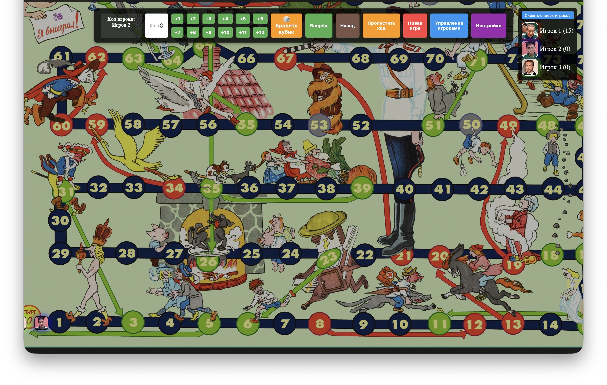

# Ходилка — браузерная настольная игра

Браузерная игра-ходилка с игровым полем, вопросами, кубиком и поддержкой до 13 игроков.



## Структура проекта

```
├── index.html              # Главная страница
├── src/
│   ├── script.js           # Игровая логика
│   └── questions.json      # База вопросов (БЛИЦ, ВОПРОС, ДУЭЛЬ)
├── assets/
│   └── images/
│       ├── f.jpg           # Фон игрового поля
│       └── 1–13.png        # Аватары игроков
└── README.md
```

## Запуск

Из-за CORS-ограничений браузера `questions.json` не загрузится через при простом открытии. 

Используйте либо плагин VSCode – Live Server (https://marketplace.visualstudio.com/items?itemName=ritwickdey.LiveServer)

либо поднимайте локальный сервер:

```bash
# Python
python3 -m http.server 8080

# Node.js
npx serve .
```

Затем открыть `http://localhost:8080`.


## Игровой процесс

- До 13 игроков ходят по очереди по полю из 90 клеток
- Ход: ввести количество шагов вручную, нажать кнопки +1…+12 или бросить 🎲 кубик
- Специальные клетки телепортируют игрока вперёд или назад
- Клетки **БЛИЦ**, **ВОПРОС**, **ДУЭЛЬ** показывают вопрос из базы

### Правила специальных клеток

| Тип | Правило |
|-----|---------|
| БЛИЦ | Правильный ответ → +1 клетка вперёд |
| ВОПРОС | Верно → +2 клетки, неверно → −1 клетка |
| ДУЭЛЬ | Выбрать противника, кто ответит правильно — идёт вперёд на 2 |

## Настройка вопросов

Редактировать `src/questions.json`. Структура:

```json
{
  "blitz":    [{ "id": 1, "question": "Текст вопроса" }],
  "question": [{ "id": 1, "question": "Текст вопроса" }],
  "duel":     [{ "id": 1, "question": "Текст вопроса" }]
}
```

## Настройки в игре

Кнопка **Настройки** позволяет изменить:
- Скорость перемещения фишек
- Номера клеток для БЛИЦ / ВОПРОС / ДУЭЛЬ
- Включить/выключить каждый тип специальных клеток

Состояние игры и настройки сохраняются в `localStorage`.


## Что необходимо реализовать
- [ ] Подготовленный список вопросов, для разных групп
- [ ] Сохранение настроек после перезапуска игры
- [ ] Улучшить карточку вопроса
- [ ] Более качественная анимация dice
- [ ] Аватарки под современные мемы?